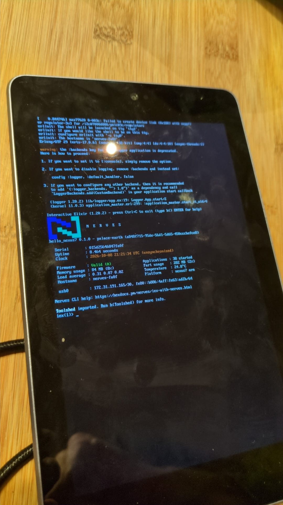

# Nexus 7 (2012) Nerves system

[](https://hex.pm/packages/nerves_system_nexus7)

Run [Nerves](https://nerves-project.org) (embedded Elixir) on the 2012
ASUS/Google Nexus 7 (`grouper`, Wi-Fi only; `tilapia`, 3G). The system boots
through mainline U-Boot and Linux 7.0. It has an IEx console on the screen,
USB networking and A/B firmware updates.



| Feature              | Description                                                   |
| -------------------- | ------------------------------------------------------------- |
| CPU                  | NVIDIA Tegra 3 T30L, 4x Cortex-A9 with NEON, 1.2 GHz          |
| Memory               | 1 GB DRAM                                                     |
| Storage              | 8/16/32 GB eMMC (`/dev/mmcblk0`)                              |
| Linux kernel         | 7.0.1 from the [libre-tegra](https://codeberg.org/libre-tegra/linux) (grate) tree, as packaged by postmarketOS |
| IEx terminal         | Tablet screen (`tty1`)                                        |
| Networking           | USB gadget Ethernet (`usb0`, CDC-ECM/RNDIS)                   |
| Wi-Fi / Bluetooth    | BCM4330 (driver and firmware load; connecting is untested)    |
| Bootloader           | Mainline U-Boot (`grouper_defconfig`) in the eMMC boot partitions |
| Firmware updates     | A/B, via fwup over SSH                                        |
| Erlang/OTP           | 29                                                            |

Status: tested on one Wi-Fi-only `grouper` (E1565). The `tilapia` and PM269
device trees are included but untested. There are no prebuilt artifacts, so
you build the system yourself (about an hour).

## Warning

Installing this system **replaces the Android bootloader and erases the whole
eMMC**. Android won't boot afterwards. You can only go back with the backups
from step 2. You need the device's Secure Boot Key (SBK) for this. Keep the
SBK and the backups private and safe. These steps rely on a bootrom exploit
(Fusée Gelée) and patched NVIDIA tools. Follow them at your own risk.

## Overview

1. Prepare the host
2. Back up the tablet and dump its SBK
3. Install mainline U-Boot
4. Build the Nerves system and your firmware
5. Install the firmware
6. Update over USB

Steps 1–3 are done once per tablet. They follow the
[libre-tegra grouper guide](https://codeberg.org/libre-tegra/user-documentation/src/branch/master/asus-google-grouper-tilapia.md)
and U-Boot's
[`doc/board/asus/grouper.rst`](https://docs.u-boot.org/en/latest/board/asus/grouper.html).
Read both if anything below is unclear. They take precedence over this
README.

## 1. Prepare the host

These steps were tested on Ubuntu (x86_64).

```sh
sudo apt install build-essential git gcc-arm-none-eabi python3-usb \
  python3-cryptography swig libc6:i386 libstdc++6:i386 zlib1g:i386 \
  device-tree-compiler mtools lzop libmnl-dev libconfuse-dev libarchive-dev \
  fastboot f2fs-tools
```

Install [fwup](https://github.com/fwup-home/fwup/releases). Also install
Erlang/OTP 29 and an Elixir built for OTP 29, for example with asdf:
`erlang 29.0.2` and `elixir 1.20.2-otp-29`. Then install the Nerves
bootstrap:

```sh
mix archive.install hex nerves_bootstrap
```

Let your user reach the tablet in APX (recovery) mode without root:

```sh
echo 'SUBSYSTEM=="usb", ATTR{idVendor}=="0955", ATTR{idProduct}=="7330", MODE="0660", TAG+="uaccess"' \
  | sudo tee /etc/udev/rules.d/51-tegra-apx.rules
sudo udevadm control --reload
```

Fetch the tools. `bootloader.bin` is the stock 4.23 bootloader. It's used
only to run nvflash for the backup.

```sh
git clone --recursive https://codeberg.org/libre-tegra/fusee-tools.git
git clone https://codeberg.org/libre-tegra/re-crypt.git
git clone https://source.denx.de/u-boot/u-boot.git

curl -L -o fusee-tools/bootloader.bin \
  https://codeberg.org/clamor-s/bootloader-collection/raw/branch/master/asus-google-grouper-tilapia-4.23-bootloader.bin

(cd fusee-tools/payloads && make -j1 ARCH=arm CROSS_COMPILE=arm-none-eabi-)
```

**APX mode:** turn the tablet off, then hold **Volume Up** while you plug USB
into the host (or hold Power + Volume Up). The screen stays black, and
`lsusb` shows `0955:7330`. Use a USB 3 (XHCI) port, because the exploit
requires one. An APX session only works once. Power-cycle back into APX before
each command below that starts a new session.

## 2. Back up and dump the SBK

Put the tablet in APX mode. Load the stock bootloader into RAM, then read the
device-specific partitions. These commands don't write to the eMMC.

```sh
cd fusee-tools
mkdir -p ../backup
./run_bootloader.sh -s T30 -t ./bct/grouper.bct -b bootloader.bin   # tilapia.bct for 3G

NV=./utils/nvflash_v1.13.87205
$NV --resume --rawdeviceread 0 2688 ../backup/bricksafe.img
$NV --resume --read EKS ../backup/eks.img
$NV --resume --read PER ../backup/factory-config.img
$NV --resume --read MDA ../backup/mda.img
$NV --resume --read GP1 ../backup/gp1.img
$NV --resume --read GPT ../backup/gpt.img
(cd ../backup && sha256sum *.img > SHA256SUMS)
```

Then power-cycle into APX again and dump the SBK:

```sh
./dump_sbk.sh -s T30
```

Save the four `0xXXXXXXXX` words, for example in `backup/sbk.txt` with mode
`600`. Copy `backup/` somewhere off the laptop too. If you also want to keep
Android's system and data, dump those partitions now with nvflash.

## 3. Install U-Boot

Build U-Boot and make the encrypted boot images for this tablet:

```sh
cd u-boot
git checkout v2026.10            # or a newer release
make CROSS_COMPILE=arm-none-eabi- grouper_defconfig
make CROSS_COMPILE=arm-none-eabi- -j"$(nproc)"
cp u-boot-dtb-tegra.bin ../re-crypt/ && cp u-boot-dtb-tegra.bin ../fusee-tools/

cd ../re-crypt
python3 re-crypt.py --dev grouper --sbk $(cat ../backup/sbk.txt) --split   # --dev tilapia for 3G
```

This produces `bct.img` and `ebt.img`. Next, put the tablet in APX mode.
Hold **Volume Down** and keep holding it while you load U-Boot into RAM:

```sh
cd ../fusee-tools
./run_bootloader.sh -s T30 -t ./bct/grouper.bct -b u-boot-dtb-tegra.bin
```

nvflash may report "bootloader failed" at the end. That's expected. The U-Boot
boot menu appears on the tablet. Use the volume keys to choose **fastboot**
and Power to confirm. Then flash U-Boot permanently:

```sh
cd ../re-crypt
fastboot flash 0.1 bct.img
fastboot flash 0.2 ebt.img
fastboot reboot
```

From now on, holding **Volume Down** at power-on opens U-Boot's boot menu:

* mount internal storage (exports the eMMC as a USB disk)
* fastboot
* update bootloader
* reboot RCM (APX)
* reboot
* power off

## 4. Build the system and your firmware

Create a Nerves project and add this system to `mix.exs`:

```elixir
@all_targets [:nexus7]

defp deps do
  [
    # ...
    {:nerves_system_nexus7, "~> 0.1", runtime: false, targets: :nexus7, nerves: [compile: true]}
  ]
end
```

You need `nerves: [compile: true]` because there are no prebuilt system
artifacts. Configure USB networking in `config/target.exs`:

```elixir
config :vintage_net,
  config: [
    {"usb0", %{type: VintageNetDirect}}
  ]
```

Then build:

```sh
export MIX_TARGET=nexus7
mix deps.get
mix firmware
```

The first build compiles Buildroot, the kernel and Erlang. It takes about an
hour and about 12 GB of disk space.

Hosts with uutils coreutils, such as Ubuntu 25.10 and later: Buildroot
rejects them. Put a directory of symlinks to the GNU versions first on your
`PATH` for the build, for example `ln -s /usr/bin/gnuinstall ~/gnu-bin/install`
for every `/usr/bin/gnu*` tool.

## 5. Install the firmware

Hold **Volume Down** while powering on, then choose **mount internal
storage**. The eMMC shows up on the host as a USB disk named `UMS disk 0`.
Unmount any partitions your desktop auto-mounted. Then either run:

```sh
mix burn                                        # pick the "UMS disk 0" device
```

or use the included script. It refuses to write to anything other than
U-Boot's USB disk and asks for confirmation:

```sh
scripts/flash-nerves.sh _build/nexus7_dev/nerves/images/my_app.fw
```

Unplug USB, then plug it back in to boot. The first boot formats the
application partition without discard. That path hasn't been tested on a
blank partition yet. If the tablet keeps resetting during its first boot,
format the partition from the host while it's in mass storage mode:
`sudo mkfs.f2fs -f -t 0 /dev/sdX4`.

## 6. Update over USB

The tablet appears as a USB Ethernet device. It gets an address in
`172.31.x.x/30` from VintageNetDirect, and is reachable as `nerves.local`.

```sh
mix upload nerves.local
# or, if that fails with "subsystem request failed" (see below):
scripts/upload.sh _build/nexus7_dev/nerves/images/my_app.fw nerves.local
```

## How booting works

* U-Boot's bootstd scans the bootable (first) MBR partition for
  `extlinux/extlinux.conf`.
* The FAT boot partition holds `a/zImage`, `b/zImage` and each slot's device
  trees. U-Boot picks the device tree for the board revision via `$fdtfile`
  (`grouper-E1565`, `grouper-PM269` or `tilapia-E1565`).
* An upgrade writes the inactive slot, then rewrites `extlinux.conf` to point
  at it. That write is the commit.
* Nerves firmware metadata is stored in U-Boot environment format at 1 MiB
  into the eMMC user area (`/etc/fw_env.config`). U-Boot itself doesn't read
  it. U-Boot's own environment lives in `mmcblk0boot1`, and Nerves never
  touches it.

| Partition       | Contents                         | Size      |
| --------------- | -------------------------------- | --------- |
| `mmcblk0p1`     | FAT boot (kernels, DTBs, extlinux) | 64 MiB  |
| `mmcblk0p2`     | Root filesystem A (squashfs)     | 256 MiB   |
| `mmcblk0p3`     | Root filesystem B (squashfs)     | 256 MiB   |
| `mmcblk0p4`     | Application data (F2FS, `/root`) | rest      |

## Limitations and known issues

* **No automatic rollback.** U-Boot doesn't count boot attempts in this
  setup, so firmware is marked valid as soon as it's written. Manual
  `Nerves.Runtime.revert/0` works.
* **Don't add `menu title`, `prompt` or `timeout` to the extlinux files.**
  They make U-Boot wait at `Enter choice:`. The power button sends an empty
  Enter, so the tablet gets stuck. Power on by plugging in USB, or press
  Power briefly.
* **Formatting skips discard.** Discard on this eMMC runs at about 3 MB/s, so
  a normal first-boot format would take over an hour. The eMMC stalls during
  that time, and the watchdog resets the tablet. The system wraps `mkfs.f2fs`
  to pass `-t 0` and mounts `/root` with `nodiscard`.
* **Unexpected resets sometimes land in APX mode** instead of U-Boot
  (black screen, `0955:7330` on USB). Hold Power to turn the tablet off, then
  power on again. Normal reboots aren't affected. The cause is unknown.
* See the hardware support table below for untested or unsupported hardware.

## Hardware support

| Hardware                         | Status                                              |
| -------------------------------- | --------------------------------------------------- |
| Display (800x1280), backlight    | Works (framebuffer console)                         |
| Touchscreen, Power/Volume keys   | Input devices present (`/dev/input/event*`)         |
| CPU frequency scaling            | Works (51 MHz – 1.3 GHz, `ondemand`)                |
| Wi-Fi (BCM4330, 2.4 GHz)         | Works: WPA2, DHCP, inbound and outbound, about 7 Mbit/s download. The firmware's built-in WPA supplicant is disabled (`/etc/modprobe.d/brcmfmac.conf`) |
| Bluetooth (BCM4330)              | Works: `hci0` up, classic inquiry scan finds devices. BlueZ is included; start `dbus-daemon` and `bluetoothd` yourself to use it |
| Audio (ALC5642), stereo speakers | Works after enabling the speaker route (see below). alsa-utils is included |
| Sensors (accel/gyro, magnetometer, light) | Present as IIO devices. Untested           |
| Battery gauge and charger        | Present as power supplies. A PC USB port may not supply enough current to charge while running |
| 3D GPU                           | Not supported (no Mesa driver for Tegra 3)          |
| Camera, GPS, 3G modem            | Not supported (missing upstream)                    |
| USB host/OTG                     | Not supported (USB is peripheral-only in the device tree) |

## Audio

The RT5640 codec starts with its speaker route switched off, and no
mixer state is restored at boot. Enable it from your application, for example
with `System.cmd/2`:

```sh
for c in "DAC MIXL INF1" "DAC MIXR INF1" "Stereo DAC MIXL DAC L1" \
         "Stereo DAC MIXR DAC R1" "SPK MIXL DAC L1" "SPK MIXR DAC R1" \
         "SPOL MIX SPKVOL L" "SPOR MIX SPKVOL R" "Speaker Channel" \
         "Speaker L" "Speaker R" "Int Spk" Speakers; do
  amixer -q -c 0 sset "$c" on
done
amixer -q -c 0 sset Speaker 20      # 0-39; 31 = 0 dB
speaker-test -D plughw:0,0 -c 2 -t sine -f 440 -l 1
```

## Host-side notes

* **`mix upload`, `scp` or `sftp` fail with "subsystem request failed".**
  Ubuntu's `/etc/ssh/ssh_config` forwards locale variables
  (`SendEnv LANG LC_* COLORTERM NO_COLOR`). Erlang/OTP 29's SSH server then
  rejects subsystem requests. `scripts/upload.sh` unsets those variables.
* **USB MACs are fixed:** `02:4e:37:00:00:02` on the tablet and
  `02:4e:37:00:00:01` on the host side. To have NetworkManager configure the
  host side automatically:

  ```sh
  nmcli con add type ethernet con-name nexus7-nerves-usb \
    ethernet.mac-address 02:4E:37:00:00:01 \
    ipv4.method auto ipv4.never-default yes ipv6.method link-local
  ```

* **Docker networks in `172.31.0.0/16` shadow the USB link.** Move them to
  another subnet if the tablet isn't reachable.

## Restoring Android

Reinstall the stock bootloader and partition layout from your backups, then
flash a factory image. The "restore" section of the libre-tegra guide linked
above describes the process. Without the backup and SBK from step 2, there's no supported way
back.

## Credits

* [libre-tegra / grate-driver](https://codeberg.org/libre-tegra) for the
  kernel, U-Boot port, fusee-tools, re-crypt and firmware
* [postmarketOS](https://postmarketos.org) for the kernel packaging and
  config
* [Nerves](https://nerves-project.org), and `nerves_system_bbb`, which this
  system is based on

## License

The build configuration is GPL-2.0 and CC0. The README is CC-BY-4.0. The
Wi-Fi firmware is covered by Apache-2.0, GPL-2.0 and a Broadcom
redistribution licence. See `REUSE.toml` and `LICENSES/`.
